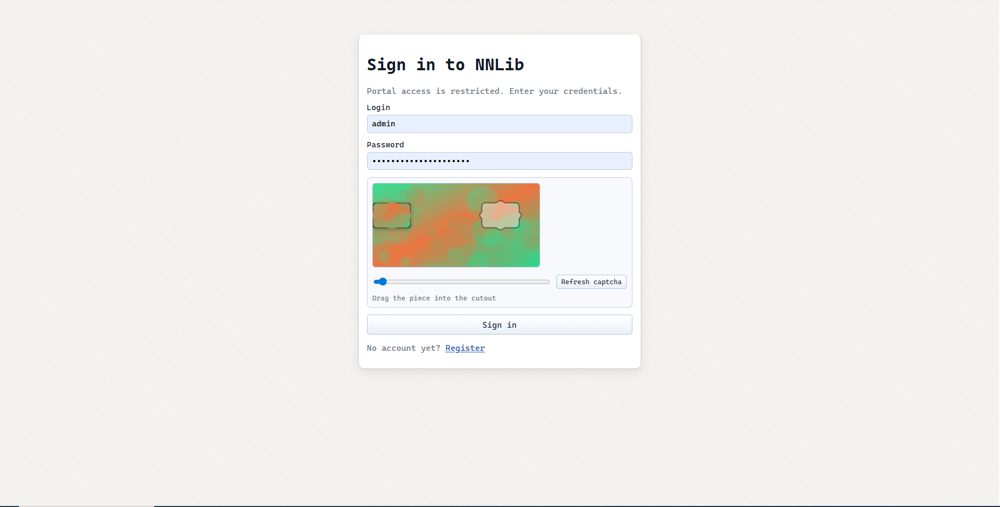
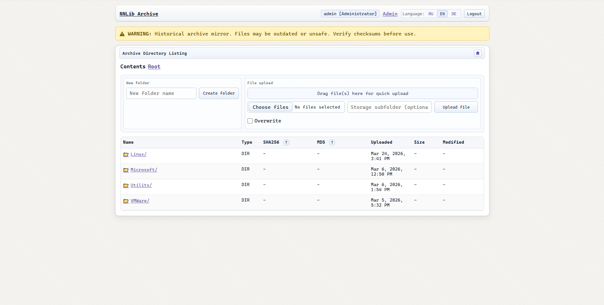
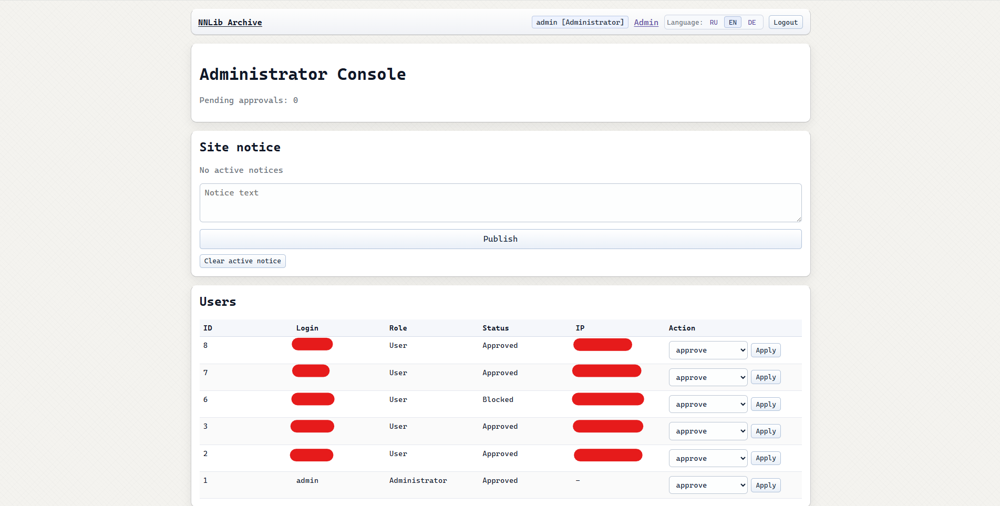

# Library Archive Portal (MVP)

Server-rendered archive portal in classic Apache-style directory listing, with modern security baseline and Telegram-driven moderation.

## Stack

- Node.js + TypeScript
- Express + EJS (SSR)
- Prisma + SQLite (WAL)
- `express-session` + Prisma session store
- Telegraf (Telegram bot, long polling)
- Vanilla JS + CSS (no SPA)

## Features

- Login/registration (`login + password`, no email), password hashing via bcryptjs.
- New users start as `PENDING` and cannot login until admin approval.
- Registration stores IP (`X-Forwarded-For` aware).
- Custom slider puzzle captcha on login/register (one-time challenge in server session with TTL).
- Archive listing with nested directories and file metadata:
  - filename
  - extension
  - SHA256
  - MD5
  - uploadAt
  - optional size/lastModified
- File detail page + comments.
- Protected downloads only via `/download/:fileId` + `X-Accel-Redirect` (`/_protected/...`).
- Minimal admin panel `/admin`:
  - user moderation (approve/reject/ban/unban)
  - directories create/update/hide
  - upload file to `STORAGE_ROOT` via web form (with optional overwrite)
  - register files from storage path (hash calculation)
  - publish/clear site notice banner
- Telegram admin bot:
  - registration alerts with inline `Approve/Reject`
  - stats command (`visits/downloads/users/pending` total + 24h)
  - user moderation actions with signed callback data (HMAC)
  - publish site notice from bot
- Audit logs for moderation/admin actions.

## Interface Preview

NNLibrary keeps a classic archive-listing style while adding practical admin tooling for daily operations.

### Login page

Secure entry point with credentials + slider captcha challenge.



### Main portal window

Directory-style listing with checksums, metadata, protected downloads, and inline admin actions.



### Admin panel

Centralized moderation and management for users, directories, file records, and site notices.



## Project Structure

- `src/server.ts` - web app
- `src/bot/index.ts` - Telegram bot process
- `src/routes/*` - auth, portal, admin, captcha
- `src/views/*` - EJS templates
- `src/public/*` - CSS and captcha JS
- `prisma/schema.prisma` - DB schema
- `scripts/seed-admin.ts` - create/update first admin from ENV
- `scripts/register-file.ts` - register single file
- `scripts/scan-storage.ts` - optional recursive storage scan
- `ecosystem.config.cjs` - PM2 config for web + bot
- `nginx/library.conf.sample` - nginx reverse-proxy + protected location

## Environment

Copy and configure:

```bash
cp .env.example .env
```

Required variables:

- `DATABASE_URL="file:./prisma/dev.db"`
- `SESSION_SECRET` (strong random >= 24 chars)
- `BOT_TOKEN`
- `ADMIN_CHAT_ID`
- `HMAC_SECRET` (strong random >= 24 chars)
- `STORAGE_ROOT=/srv/storagebox/library`
- `BASE_URL=https://<domain>`
- `PORT=3010`
- `ADMIN_LOGIN`
- `ADMIN_PASSWORD`
- `MAX_UPLOAD_SIZE_MB=10240` (10 GB default limit for one uploaded file)
- `ADMIN_ALLOWED_IPS` (comma-separated admin allowlist, e.g. `203.0.113.10,127.0.0.1`)
- `AV_SCAN_MODE` (`off|optional|required`, recommended: `off`)
- `AV_COMMAND` (`clamscan` or `clamdscan`)
- `AV_TIMEOUT_MS` (scanner timeout in ms)

`ADMIN_ALLOWED_IPS` accepts exact IP values only (no CIDR).
If `AV_SCAN_MODE=required`, upload is blocked when scanner is unavailable or scan fails.
If `ADMIN_ALLOWED_IPS` is omitted, default allowlist is `127.0.0.1`.

## Local Run

```bash
npm install
npx prisma generate
npx prisma migrate dev --name init
npm run seed:admin
npm run dev:web
# in another terminal
npm run dev:bot
```

## Production (Ubuntu 24.04, non-root runtime)

Example paths:
- app: `/opt/Library`
- storage: `/srv/storagebox/library`

1) Create dedicated service user and set ownership:

```bash
sudo adduser --disabled-password --gecos "" librarysvc
sudo chown -R librarysvc:librarysvc /opt/Library
sudo chmod 750 /opt/Library
sudo chmod 600 /opt/Library/.env
sudo mkdir -p /opt/Library/logs
sudo chown librarysvc:librarysvc /opt/Library/logs
```

2) Grant service user read/write to storage for web uploads:

```bash
sudo groupadd -f storagebox
sudo usermod -aG storagebox librarysvc
sudo usermod -aG storagebox www-data
sudo chgrp -R storagebox /srv/storagebox /srv/storagebox/library
sudo chmod 2770 /srv/storagebox /srv/storagebox/library
sudo find /srv/storagebox/library -type d -exec chmod 2770 {} +
sudo find /srv/storagebox/library -type f -exec chmod 660 {} +
```

3) Install antivirus scanner for upload protection:

```bash
sudo apt-get update
sudo apt-get install -y clamav clamav-daemon
sudo freshclam
sudo systemctl enable --now clamav-daemon
```

4) Build and launch app as `librarysvc`:

```bash
sudo -u librarysvc -H bash -lc '
cd /opt/Library &&
npm install &&
npx prisma generate &&
npx prisma migrate deploy &&
npm run seed:admin &&
npm run build &&
pm2 start ecosystem.config.cjs &&
pm2 save
'
```

5) Enable PM2 startup for `librarysvc`:

```bash
sudo -u librarysvc -H bash -lc 'pm2 startup systemd -u librarysvc --hp /home/librarysvc'
```

Run the `sudo ...` command printed by `pm2 startup`.

PM2 useful commands:

```bash
sudo -u librarysvc -H pm2 status
sudo -u librarysvc -H pm2 logs library-web
sudo -u librarysvc -H pm2 logs library-bot
sudo -u librarysvc -H pm2 restart library-web library-bot
```

## nginx Setup

Use `nginx/library.conf.sample` as base.

### GeoIP allowlist variable

The sample config uses:

```nginx
if ($geo_allow = 0) { return 444; }
```

This variable is expected to be defined globally in your nginx context (typically in `http {}` via `geo` / `map` include).

If you do not use GeoIP/IP allowlisting, either:

- define `$geo_allow` as always `1`, or
- remove these checks from `server` locations.

Example minimal global definition:

```nginx
map $remote_addr $geo_allow {
    default 1;
}
```

Critical part for protected downloads:

```nginx
location /_protected/ {
    internal;
    alias /srv/storagebox/library/;
}
```

Web app responds with `X-Accel-Redirect: /_protected/<relative_path>` after auth/status checks.
Storage path is never exposed as public static URL.

## File Registration

Register one file manually:

```bash
npm run register:file -- --path "subdir/file.zip" --dir 1 --name "file.zip"
```

Or upload through web admin panel:

- open `/admin`
- section `Upload File To Storage`
- pick file and optional subdir (inside `STORAGE_ROOT`)
- submit `Upload & Register`

Scan and sync entire storage (optional):

```bash
npm run scan:storage -- --dir 1
```

## Security Notes

- Helmet headers enabled.
- Secure session cookie (`httpOnly`, `sameSite=lax`, `secure` in production).
- CSRF protection for form POSTs.
- Admin panel IP allowlist (`ADMIN_ALLOWED_IPS`).
- Rate limits on auth/captcha/download endpoints.
- Upload antivirus scanning (`AV_SCAN_MODE`, `AV_COMMAND`).
- Input validation with Zod.
- Download path traversal protection:
  - file selected by DB `fileId`
  - path normalized and verified inside `STORAGE_ROOT`
- HMAC-signed Telegram callback data.
- Audit logs persisted (`AuditLog`).

## Default Routes

- `/login`
- `/register`
- `/`
- `/dir/:id`
- `/file/:id`
- `/download/:fileId`
- `/admin`

## Notes

- SQLite WAL is enabled at startup for both web and bot processes.
- `BASE_URL` is reserved for future link generation and integrations.
- The app binds to `127.0.0.1:3010` for nginx reverse proxy.

## Changelog

- `CHANGELOG.md`

## License

MIT (`LICENSE`)


